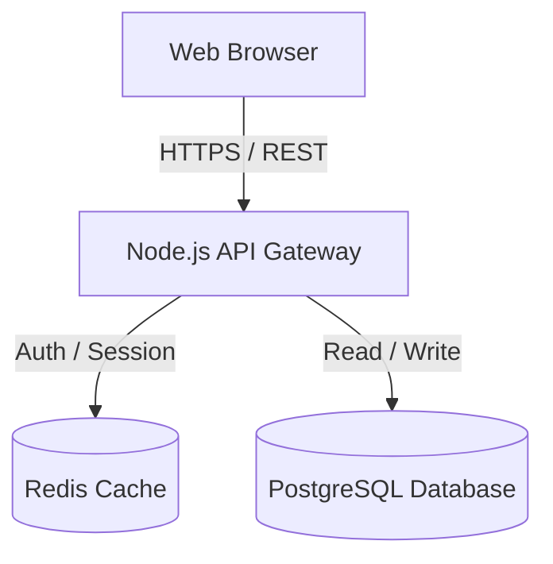

# Documentation: High-Signal Technical Writing & Architecture Specs

> **Source Attribution**: Adapted and evolved from vudovn's `antigravity-kit` (MIT).

## 1. Documentation Principles

Good engineering documentation is concise, accurate, and actionable:
1. **Self-Describing Code First**: Do not write comments explaining *what* simple code does. Write documentation explaining *why* non-obvious architecture or business rules exist.
2. **Single Source of Truth**: Generate API specifications directly from type definitions or route schemas whenever possible.
3. **Executable Examples**: All code snippets in READMEs or guides must be copy-paste runnable without syntax errors.

---

## 2. Standard Document Structures

### A. Repository README Structure
```markdown
# [Project Name]
[1-paragraph summary of purpose, target users, and key features.]

## Prerequisites & Quickstart
```bash
git clone <url>
cd <repo>
npm install
npm run dev
```

## Environment Configuration
| Variable | Description | Default | Required |
| :--- | :--- | :--- | :--- |
| `DATABASE_URL` | PostgreSQL connection string | `postgres://localhost:5432/app` | Yes |
| `PORT` | HTTP server listening port | `3000` | No |

## Architecture Overview
[Mermaid diagram or brief bullet points detailing frontend, backend, and database.]

## Testing & Verification
```bash
npm test
```
```

### B. Architecture Diagrams (Mermaid)
Use standard Mermaid syntax for architectural flowcharts and sequence diagrams:


---

## 3. Anti-Patterns
- **Documentation Rot**: Writing detailed docs that immediately become outdated because they repeat code details.
- **Fluff & Filler**: Writing paragraphs of marketing prose in an engineering README.
- **Undocumented Environment Setup**: Failing to specify required `.env` variables or port requirements.

---

## 4. Verification Check
- Can a new developer clone the repository and run it locally following only the README?
- Are all environment variables documented with examples?
- Do all Mermaid diagrams render cleanly without syntax errors?
